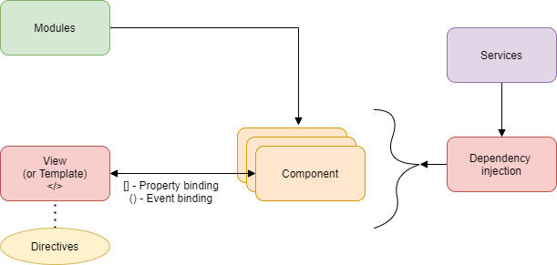
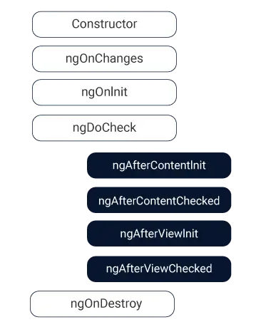

# Angular 

## Table of Contents

| No. | Questions |
| --- | --------- |
||**Angular**|
|1|[What is use of Angular](#what-is-use-of-angular)|
|2|[Difference between AngularJS n Angular](#difference-between-angularjs-n-angular)|
|3|[What are directives in Angular](#what-are-directives-in-angular)|
|4|[Explain different types of Angular](#explain-different-types-of-angular)|
|5|[What is typescript and why do we need it?](#what-is-typescript-and-why-do-we-need-it?)|
|6|[Explain importance of Angular CLI](#explain-importance-of-angular-cli)|
|7|[Explain importance of Component and Modules](#explain-importance-of-component-and-modules)|
|8|[what are Annotation or Metadata](#what-are-annotation-or-metadata)|
|9|[What is template](#what-is-template)|
|10|[Explaing four types of data binding in angular](#explaing-four-types-of-data-binding-in-angular)|
|11|[Explain architecture of Angular](#explain-architecture-of-angular)|
|12|[What is SPA](#what-is-spa)|
|13|[How to implement SPA in angular](#how-to-implement-spa-in-angular)|
|14|[What is routing ](#what-is-routing)|
|15|[How you implement routing](#how-you-implement-routing)|
|16|[What is lazy loading](#what-is-lazy-loading)|
|17|[How to implement lazy loading](#how-to-implement-lazy-loading)|
|18|[Define services](#define-services)|
|19|[What is dependency injection](#what-is-dependency-injection)|
|20|[How to implement dependency injection](#how-to-implement-dependency-injection)|
|21|[what is benefit of dependency injection](#what-is-benefit-of-dependency-injection)|
|22|[differentiate between ng serve and ng build](#differentiate-between-ng-serve-and-ng-build)|
|23|[Explain --prod parameter in ng build](#explain---prod-parameter-in-ng-build)|
|24|[Explain ViewChild and ViewChildren](#explain-viewchild-and-viewchildren)
|25|[Why do we need template reference variables?](#why-do-we-need-template-reference-variables?)
|26|[What is ContentProjection?](#what-is-contentprojection?)
|27|[Explain content projection slot?](#explain-content-projection-slot?)
|28|[Explain events and sequence of component life cycle?](#explain-events-and-sequence-of-component-life-cycle?)
|29|[Constructor vs ngOnInit()](#constructor-vs-ngoninit())

1. ### What is use of Angular

Angular is a Javascript binding framework which binds the HTML UI and Javascript Model 
* It is also heps you to build SPA by using concept of routing.
* It also has lot of other features like HTTP, DI, Input, Output because of wich you do not need other frameworks

2. ### Difference between AngularJS n Angular

||AngularJS  |Angular|
|---|---|---|
|Language|Javascript|Typescript|
|Architecture|Controller|Component|
|CLI||Yes|
|Lazy loading||Yes|
|Server side||Yes|

3. ### What are directives in Angular 

Directives are decorated on the HTML elements

4. ### Explain different types of Angular

* S - Structural
* A - Attribute
* C - Component

* Structual - Changes DOM layout by adding and removing elements

```html
<tr *ngFor ="let cust of customerModels" >
    <td>{{cust.CustomerCode}}</td>
    <td>{{cust.CustomerName}}</td>
    <td>{{cust.CustomerAmount}}</td>
</tr>
```

* Attribute - Changes appearance and behaviour of HTML elemets

```html
 <div   [hidden]="Hide()">Customer
        code
        format is not proper</div>
```

* Component - Directives with templates. It's like user control

```html
 <my-grid></my-grid>
```

we have to use component dectorator
```ts
@Component(

)
```

5. ### What is typescript and why do we need it?

* Typescript is superset of Javascript. It added strongly types to Javascript.
* It gives nice object-oriented programming environment which transpiles/converts to javascript
* Because of strongly type we will get error during compile time

6. ### Explain importance of Angular CLI

Angular CLI is comand line interface by which we can create initial Angular project template. 

```cmd
$ npm install -g @angular/cli
ng new project-app
```

7. ### Explain importance of Component and Modules

* Component is where you write your binding code. 
* Module logically groups components

we can create component by ```@component``` and module by ```@NgModule```

8. ### what are Annotation or Metadata

It's decorator

9. ### What is template

Template is an HTML view of Angular in which we can write directives.

2 types
* Inline (template)
* Seperate HTML file (templateUrl)

10. ### Explaing four types of data binding in angular

* Property binding (UI to component) - []
* Event binding (component to UI) - ()
* Interpolation (Expression) - {{}}
* Two way binding - [()]

11. ### Explain architecture of Angular



* Template - HTML view 
* Component - Binds View and Model
* Modules - Groups Components logically
* Bindings - Defines how view and component communicate
* Directive - Changes HTML dom behaviour
* Services - Helps share common logic across project
* DI - Dependency injection helps to inject instance across constructor

12. ### What is SPA

Single page application, where main UI gets loaded once and then UI is loaded on demand

13. ### How to implement SPA in angular

Via Routing

14. ### What is routing 

* Routing is simple collection which has two things URL and compoent 
* when this URL is called, it loads appropriate component

15. ### How you implement routing

Step 1: Define routing collection in app-routing.ts

Step 2: Define ```<router-outlet/>``` where component should be loaded

Step 3: To navigate define ```routerLink```

16. ### What is lazy loading

Lozy loadng means on demand loading. Loading only the necessary HTML, CSS and Javascript files, so that you have better performance

17. ### How to implement lazy loading

Step 1: Create seperate module w.r.t compoent 

```cmd
$ ng g module Customer/Customer --flat=true --routing=true

$ ng g module Supplier/Supplier --flat=true --routing=true 
```

Step 2: use loadChildren in app-routing.modules.ts file

```ts
const routes: Routes = [
  { path: 'Home', component: HomeComponent },
  { path: 'Customer', loadChildren: './Customer/customer.module#CustomerModule' },
  { path: 'Supplier', loadChildren: './Supplier/supplier.module#SupplierModule' },
  { path: '', component: HomeComponent }
];
```

Step 3: In child routing

```ts
const routes: Routes = [
  { path: '', component: SupplierComponent }
];
```

18. ### Define services

Services helps us to share common logic accross angular project

19. ### What is dependency injection

Dependency injection whether creating object instances from component. Angular injects via constructor

There is two types of DI

* Centrailised DI
* Conditional DI

20. ### How to implement dependency injection

Steps1: Create inheritance logger file

```ts
export interface ILogger {
    Log();
}

export class BaseLogger implements ILogger {
    Log() {

    }
}

export class ConsoleLogger extends BaseLogger {
    Log() {
        console.log("consoler logger");
    }
}

export class DbLogger extends BaseLogger {
    Log() {
        console.log("DB logger");
    }
}
```

Step 2: Adding BaseLogger to app.module.ts

```ts
providers: [
    // centralised DI
    { provide: BaseLogger, useClass: DbLogger },
]
```

Step 3: Implementing in component

```ts
export class CustomerComponent implements OnInit {

  logObj: BaseLogger;

  constructor(log: BaseLogger) {
    this.logObj = log;
    this.logObj.Log();
  }
```

For conditional based DI

in app.module.ts

```ts
providers: [
    // centralised DI
    { provide: BaseLogger, useClass: ConsoleLogger },

    // Conditional DI
    { provide: '1', useClass: ConsoleLogger },
    { provide: '2', useClass: DbLogger },
  ],
```

In Customer component

```ts
logObj: BaseLogger;

constructor(log: Injector) {
    this.logObj = log.get('1');
    this.logObj.Log();
}
```

21. ### what is benefit of dependency injection

* decouple class 

22. ### differentiate between ng serve and ng build

* ng serve - builds in inmemory 
* ng build - hard disk 

23. ### Explain --prod parameter in ng build

Compresses our JS files

24. ### Explain ViewChild and ViewChildren

*ViewChild* helps to reference view object in component to which it is connected

*ViewChild* references one object while *ViewChildren* reference collection

```html
<div #div1>This is div1</div>
```
```ts
export class comp1{
  @ViewChild('div1', ... )
}
```

25. ### Why do we need template reference variables?

A template reference variable is used to give reference to a DOM element, component, directive or web component within template 

```html
<div #div1>This is div1</div>
{{div1.textContent}}
```

26. ### What is ContentProjection?

Scnerio where we want to project content from parent to child component

```ts
<ng-content>
</ng-content>
```

27. ### Explain content projection slot?

If we want to project specific content to specific slot

```ts
<ng-content select="slot1"></ng-content>
```

28. ### Explain events and sequence of component life cycle?

3 most commonly used hooks

|Life cycle hook|Purpose|
|---|---|
|ngOnChanges| Executes, everytiem value of input property changes. The hook method recevies a SimpleChanges object containing current and previous property values.|
|ngOnInit| Executes after constructor and aftre ngOnChange hook for first time. It is most commonly used for component initialisatino and retreivingg data from database|
|ngOnDestroy|Generally used for performing cleanup|





29. ### Constructor vs ngOnInit()

|Constructor  |ngOnInit()|
|---|---|
|typescript concept|angular concept|
|initialize class variables|fires after UI is binded wit component|
|DI|loading of UI|