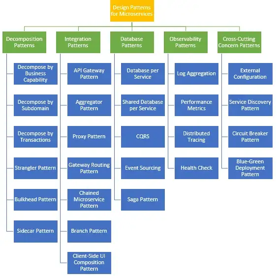

# Design Pattern

## Table of Contents

| No. | Questions |
| --- | --------- |
||**Design Pattern**|
|	1	|	[What are design pattern used in your project](#What-are-design-pattern-used-in-your-project)	|

## What are design pattern used in your project

Depends on project, CQRS, Mediator is combination for CQRS, Repository, if we use repository then we have to use UOW, Factory Design pattern for centralize object creation, Decorator for dynamic validation, Adapter, Strategy, Bridge and so

## What are design pattern used in microservice project

## One line defination of design pattern 

### Creational Patterns
* <b>Abstract Factory</b>: Creates an instance of several families of classes
* <b>Builder</b>: Separates object construction from its representation
* <b>Factory Method</b>: Creates an instance of several derived classes
* <b>Prototype</b>: A fully initialized instance to be copied or cloned
* <b>Singleton</b>: A class in which only a single instance can exist

### Structural Patterns
* <b>Adapter</b>: Match interfaces of different classes
* <b>Bridge</b>: Separates an object’s abstraction from its implementation
* <b>Composite</b>: A tree structure of simple and composite objects
* <b>Decorator</b>: Add responsibilities to objects dynamically
* <b>Façade</b>: A single class that represents an entire subsystem
* <b>Flyweight</b>: A fine-grained instance used for efficient sharing
* <b>Proxy</b>: An object representing another object

### Behavioral Patterns
* <b>Mediator</b>: Defines simplified communication between classes
* <b>Memento</b>: Capture and restore an object's internal state
* <b>Interpreter</b>: A way to include language elements in a program
* <b>Iterator</b>: Sequentially access the elements of a collection
* <b>Chain of Resp</b>: A way of passing a request between a chain of objects
* <b>Command</b>: Encapsulate a command request as an object
* <b>State</b>: Alter an object's behavior when its state changes
* <b>Strategy</b>: Encapsulates an algorithm inside a class
* <b>Observer</b>: A way of notifying change to a number of classes
* <b>Template Method</b>: Defer the exact steps of an algorithm to a subclass
* <b>Visitor</b>: Defines a new operation to a class without change

