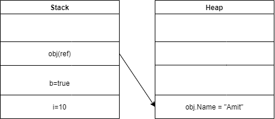

# C# and .Net Framework Fundamentals

## What is Intermediate Language (IL) code (or MSIL-Microsoft ILS or CIL-Common IL )

* IL code is partially compiled code
* on runtime this code is compiled to machine specific using the environmental properties (CPU,OS, machine configuration etc).

via ILDASM tool we can view a IL code of a DLL or EXE

## JIT (Just in compiler)

JIR compiled IL code to machine language

## Different types of JIT

* Normal-JIT (Default): - Normal-JIT compiles only those methods that are called at runtime (cached takes more memory like ASP.NET and windows application)
* Econo-JIT: - Econo-JIT compiles only those methods that are called at runtime (No caching takes less memory like mob device and console applicaion)
* Pre-JIT: - Pre-JIT compiles complete source code into native code in a single compilation cycle. This is done at the time of deployment of the application

## CLR (Common Language Runtime)

* Invokes JIT to compile from IL to machine language or native code
* Cleans an unused objects by using GC

## Managed code & unmanaged code

* Managed code - which runs under the control of CLR
* Unmanaged code - which runs outside CLR (like C++, C etc)

## Garbage collector

Garbage collector is a back ground process which cleans unused managed resources. 

```c#
for (int a =0; a<1000000000; a++){
       cls obj = new cls();
}
```

Can be checked via Visual studio Diagonotic viewer or CLR profiler 

## CTS (Common Type System)

Ensures data types defined in two different languages gets compiled to a common data type.

```vb
Dim i As Integer
```

```c#
int i;
```

## CLS(Common Language Specification)

Specification/set of rules/Guideliness of the source code.

## Difference between Stack and Heap

Stack memory stores data types like int, double, boolean,
Heap memory stores like string and objects.

## Difference between value and reference type

Value types contains actual data
Reference types contains pointers and pointers point to actual data

```c#
int i =10;
bool b = true;
Customer obj= new Customer();
obj.Name = "Amit";
```



## Difference between boxing and unboxing

Box - Convert from value to reference
Unboxing - reference type to value

VR-B
RV-U

```c#
public void method()
{
     int i=10;
     object obj =I;   //boxing
     int j =(int)obj;  //unboxing
}
```

unboxing and boxing bring down performance because data has to jump between heap and stack memory types

## Explain casting, implicit casting and explicit casting

Casting where we convert one type of data type to other data type

* Implicit casting -  move from lower to higher data type
* Explicit casting -  move from higher to lower data type

```c#
int i1 =10;
double d1 =i1; // implict casting

double d2 = 500.2;
int y = (int)d2; // explicit casting - data lose
```

## Difference between Array and ArrayList

||Array|ArrayList|
|---|---|---|
|Fixed length|yes|no|
|Strongly typed|yes|no|
|Performance|Better then Array list|Slower because of boxing/unboxing|

ArrayList is slower than Array because of Boxing and Unboxing

```c#
int[] arr = {1,2,3};  

ArrayList arrList = new ArrayList();
arrList.Add(1);
arrList.Add(2);
arrList.Add("three");
```

## Generic collection

Generic collection is strongly typed and flexible. It has better performance as compared to ArrayList

```c#
List<int> lt = new List<int>();
lt.Add(1);
lt.Add(2);
```

## What are threads(multithreading)

If we want to run code parallely then we use threads.

```c#
Thread t1 = new Thread(Method1);
t1.Start();

Thread t2 = new Thread(Method2);
t2.Start();
```

## How are threads different from TPL?  

```c#
Task t1 = new Task(Method1);
t1.Start();

Task t2 = new Task(Method2);
t2.Start();
```

## Difference between Task and Thread

Importance of task
* parallel processing
* return, result, cancel, Async, Await

## How do you handle exceptions in c#?

```c#
try{
    int z =1/0;
} catch(Exception ex){
    Console.WriteLine("Exception");
}
finally
{
    Console.WriteLine("Clean up code");
}
```

## What is finally

It executed, if code throw exception or not

## What out keyword

If we want multiple return values from funtion 

```c#
Main(){
    Calculate(10,5, out add, out sub);
}

Calculate(int n1, int n2, out int add, out int sub){
    add = n1 + n2;
    sub = n1 - n2;
}
```

## Difference between ref and out?

* In ref we have to initialize the value before passing
* In out we have to modify inside the function

ref
```c#
static void methodFunction(ref int i)
{
    i = i + 44;
}
main()
{ 
    int val = 10; // have to initial the value
    methodFunction(ref val);
    Console.WriteLine(val);
}
```

out 
```c#
static void methodFunction(out int i)
{
    i = 44;
}
main()
{ 
    int val;
    methodFunction(out val);
    Console.WriteLine(val);
}
```

## Delegates and it's usage

Delegates are callbacks which helps to communicate between async and parallel execution

Example: 
if you have two parallel process and if you need to send data to other parallel process. In this scenario delegates will be helpful

## Multicast delegates

Multicast delegates is nothing but basically multiple methods runs at one moment of time

Example: 
Broadcast error message via email, file log, sms, event log etc

```c#
class Example
{
    public delegate void MyDelegate();

    private void Subscriber1(){
        Console.WriteLine("Subscriber 1");
    }

    private void Subscriber2(){
        Console.WriteLine("Subscriber 2");
    }

    void button_click()
    {
        MyDelegate mydele =null;
        mydele += this.Method1;
        mydele += this.Method2;
        mydele.Invoke();
    }
}
```
## Anonymous method

* If we want to use the delegate only inside the same function
* Reduce overhead of instantiating the delegate thus increase performance

## Events

Event use delegates internally. They encapsulate delegates and make them safe

```c#
void button_click()
{
    MyDelegate mydele =null;
    mydele += this.Method1;
    mydele += this.Method2;
    mydele = null;              // throw exception
}
```

## Difference between Delegates and Events

* Events uses delegates
* Delegates are for callbacks, not encapsulated
* Events are publisher subscriber model, encapsulated

## use of “using” keyword

* Using directives

```c#
using System;
using System.IO
using Namespace = Application.Services;
```

These are used to import namespaces (or create aliases for namespaces or types). These go at the top of the file, before any declarations

* Using statements

```c#
using (Stream input = File.OpenRead(filename))
{
    ...
}
```

This can only be used with types that implement IDisposable, and is syntactic sugar for a try/finally block which calls Dispose in the finally block

## Equivalent code of using statement

```c#
using(MyType obj = new MyType())
{
  //... do stuff.
}
```

Is equivalent to:

```c#
MyType obj = new MyType();
try
{
  //.... do stuff
}
finally
{
  if(obj != null)
  {
      obj.Dispose();
  }
}
```
