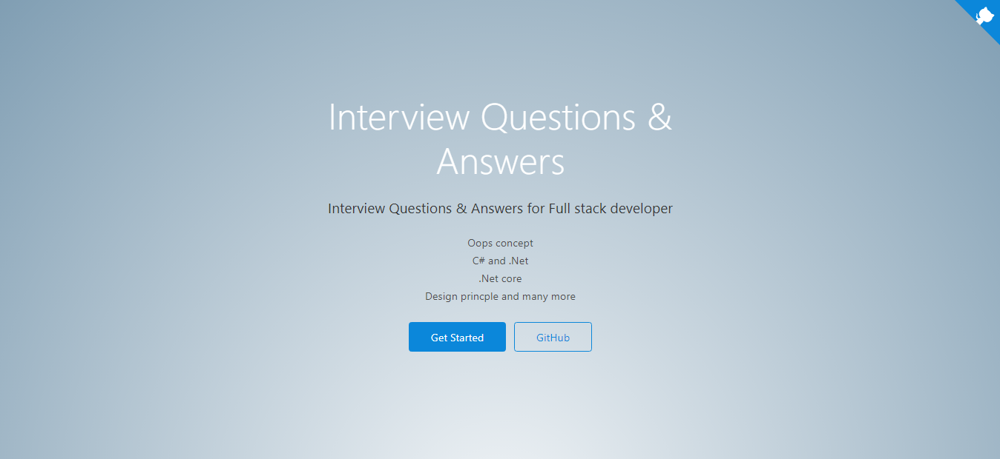
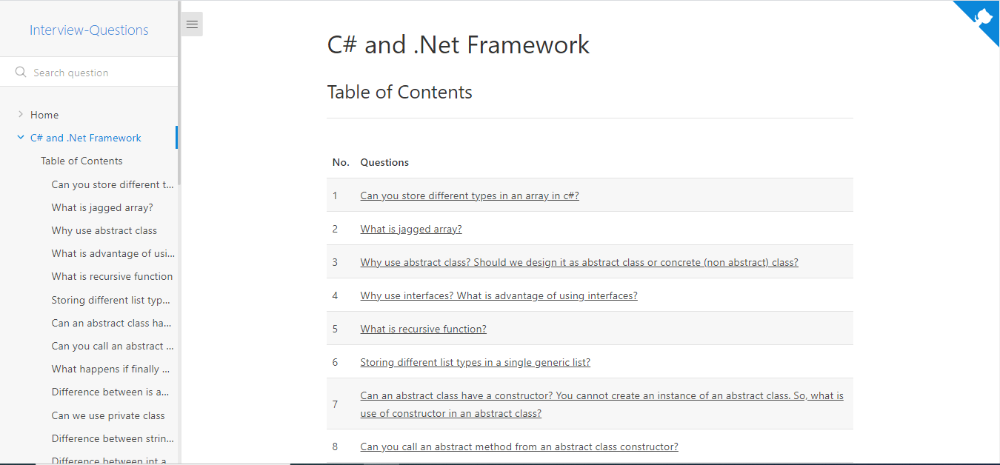

# Full stack developer - Interview Questions & Answers

Crack you next tech interview or for technical recruiters, team leads

## Give a Star! :star:

If you like or are using this project to learn or start your solution, please give it a star. Thanks!

## Support This Project

If you have found this project helpful, either as a library that you use or as a learning tool, please consider buying me a coffee:

## Screenshots

### website link

[Link](https://amitpnk.github.io/interview-questions)

### screenshot of website

  
  

<!-- 

 -->

## Reference

- Kudvenkat youtube channel
- Shivprasad Koirala youtube channel

## Contact

Having any issues or troubles getting started? Drop a mail to amit.naik8103@gmail.com or [Raise a Bug or Feature Request](https://github.com/Amitpnk/Clean-architecture-ASP.NET-Core/issues/new). Always happy to help.
