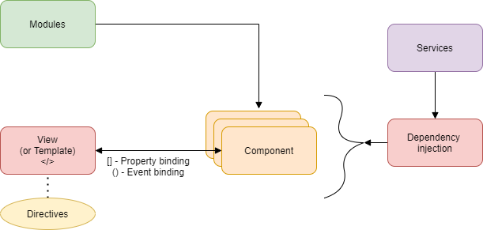

# C# Interview Questions & Answers

## Table of Contents

| No. | Questions |
| --- | --------- |
||**C# and OOPS**|
|1  | [Can you store different types in an array in c#?](#can-you-store-different-types-in-an-array-in-c#?) |
|2  | [What is jagged array?](#what-is-jagged-array) |
|3  | [Why use abstract class? Should we design it as abstract class or concrete (non abstract) class?](#why-use-abstract-class)  |
|4  | [Why use interfaces? What is advantage of using interfaces?](#what-is-advantage-of-using-interfaces?) |
|5  | [What is recursive function?](#what-is-recursive-function?) |
|6  | [Storing different list types in a single generic list?](#storing-different-list-types-in-a-single-generic-list?) |
|7  | [Can an abstract class have a constructor? You cannot create an instance of an abstract class. So, what is use of constructor in an abstract class?](#can-an-abstract-class-have-a-constructor?) |
|8  | [Can you call an abstract method from an abstract class constructor?](#can-you-call-an-abstract-method-from-an-abstract-class-constructor?)|
|9  | [What happens if finally block throws an exception? How to handle exceptions that occur in finally block](#what-happens-if-finally-block-throws-an-exception?)|
||**SQL server**|
|1  | [Defining SQL order of execution](#defining-sql-order-of-execution) |
|2  | [How to find nth highest salary in sql](#how-to-find-nth-highest-salary-in-sql) |
|3 | [How to find duplicate rows from a SQL Table](#how-to-find-duplicate-rows-from-a-sql-table) |
|4 | [Can sql views be updated](#can-sql-views-be-updated) |
|5 | [SQL query to find employees hired in last n months](#sql-query-to-find-employees-hired-in-last-n-months) |
|6 | [Transform rows into columns in sql server](#transform-rows-into-columns-in-sql-server) |
|7 | [SQL query to find rows that contain only numerical data](#sql-query-to-find-rows-that-contain-only-numerical-data) |
|8 | [SQL Query to find department with highest number of  employees](#sql-query-to-find-department-with-highest-number-of-employees) |
|9 | [Different types of join in sql](#different-types-of-join-in-sql) |
|10 | [What is purpose of right join?](#what-is-purpose-of-right-join) |
||**Angular**|
|1|[What is use of Angular](#what-is-use-of-angular)|
|2|[Difference between AngularJS n Angular](#difference-between-angularjs-n-angular)|
|3|[What are directives in Angular](#what-are-directives-in-angular)|
|4|[Explain different types of Angular](#explain-different-types-of-angular)|
|5|[What is typescript and why do we need it?](#what-is-typescript-and-why-do-we-need-it?)|
|6|[Explain importance of Angular CLI](#explain-importance-of-angular-cli)|
|7|[Explain importance of Component and Modules](#explain-importance-of-component-and-modules)|
|8|[what are Annotation or Metadata](#what-are-annotation-or-metadata)|
|9|[What is template](#what-is-template)|
|10|[Explaing four types of data binding in angular](#explaing-four-types-of-data-binding-in-angular)|
|11|[Explain architecture of Angular](#explain-architecture-of-angular)|
|12|[What is SPA](#what-is-spa)|
|13|[How to implement SPA in angular](#how-to-implement-spa-in-angular)|
|14|[What is routing ](#what-is-routing)|
|15|[How you implement routing](#how-you-implement-routing)|
|16|[What is lazy loading](#what-is-lazy-loading)|
|17|[How to implement lazy loading](#how-to-implement-lazy-loading)|
|18|[Define services](#define-services)|
|19|[What is dependency injection](#what-is-dependency-injection)|
|20|[How to implement dependency injection](#how-to-implement-dependency-injection)|
|21|[what is benefit of dependency injection](#what-is-benefit-of-dependency-injection)|
|22|[differentiate between ng serve and ng build](#differentiate-between-ng-serve-and-ng-build)|
|23|[Explain --prod parameter in ng build](#explain---prod-parameter-in-ng-build)|


## C# and OOPS

1. ### Can you store different types in an array in c#?

Yes, we care create by using an object array and ArrayList

#### Example 1:

```c#
class Program
{
    static void Main()
    {
        object[] objectArray = new object[3];
        objectArray[0] = 101; // integer
        objectArray[1] = "C#"; // string

        Customer c = new Customer();
        c.ID = 99;
        c.Name = "Pragim";

        objectArray[2] = c; // Customer - Complext Type 

        // loop thru the array and retrieve the items
        foreach (object obj in objectArray)
        {
            Console.WriteLine(obj);
        }
    }
}

class Customer
{
    public int ID { get; set; }
    public string Name { get; set; }

    public override string ToString()
    {
        return this.Name;
    }
}
```

#### Example 2:

```c#
class Program
{
    static void Main()
    {
        System.Collections.ArrayList arrayList = new System.Collections.ArrayList();
        arrayList.Add(101); // integer
        arrayList.Add("C#"); // integer

        Customer c = new Customer();
        c.ID = 99;
        c.Name = "Pragim";

        arrayList.Add(c); // Customer - Complext Type 

        // loop thru the array and retrieve the items
        foreach (object obj in arrayList)
        {
            Console.WriteLine(obj);
        }
    }
}
```

**[⬆ Back to Top](#table-of-contents)**

2. ### What is jagged array?

A jagged array is an array of arrays.

```c#
class Program
{
    static void Main()
    {
        string[] employeeNames = new string[3];
        employeeNames[0] = "Mark";
        employeeNames[1] = "Matt";
        employeeNames[2] = "John";

        string[][] jaggedArray = new string[3][];
        
        jaggedArray[0] = new string[3];
        jaggedArray[1] = new string[1];
        jaggedArray[2] = new string[2];
        
        jaggedArray[0][0] = "Bachelor";
        jaggedArray[0][1] = "Master";
        jaggedArray[0][2] = "Doctorate";

        jaggedArray[1][0] = "Bachelor";

        jaggedArray[2][0] = "Bachelor";
        jaggedArray[2][0] = "Master";

        for(int i=0; i< jaggedArray.Length; i++)
        {
            Console.WriteLine(employeeNames[i]);
            Console.WriteLine("------------");

            string[] innerArray = jaggedArray[i];
            for(int j=0; j< innerArray.Length; j++))
            {
                Console.WriteLine(innerArray[j]);
            }
        }
    }
}
```

**[⬆ Back to Top](#table-of-contents)**

3. ### Why use abstract class

When we want to move common functionality of 2 or more related classes into a base class and when we don't want base class to be instantiated

```c#
static void Main(string[] args)
{

    FullTimeEmployee fullTimeEmployee = new FullTimeEmployee()
    {
        Id = 101,
        FirstName = "Mark",
        LastName = "May",
        AnnualSalary = 3500000
    };

    Console.WriteLine(fullTimeEmployee.GetFullName());
    Console.WriteLine(fullTimeEmployee.GetMonthlySalary());

    Console.WriteLine("Hello World!");

    ContractEmployee contractEmployee = new ContractEmployee()
    {
        Id = 101,
        FirstName = "Mark",
        LastName = "May",
        HourlyPay = 40000,
        TotalHours = 40
    };

    contractEmployee.GetFullName();
    contractEmployee.GetMonthlySalary();
}

public abstract class BaseEmployee
{
    public int Id { get; set; }
    public string FirstName { get; set; }
    public string LastName { get; set; }

    public string GetFullName()
    {
        return FirstName + " " + LastName;
    }
}

public class FullTimeEmployee : BaseEmployee
{
    public int AnnualSalary { get; set; }

    public int GetMonthlySalary()
    {
        return AnnualSalary / 12;
    }
}

public class ContractEmployee : BaseEmployee
{
    public int HourlyPay { get; set; }
    public int TotalHours { get; set; }

    public int GetMonthlySalary()
    {
        return TotalHours * HourlyPay;
    }
}
```

4. ### What is advantage of using interfaces?

* Interfaces allow us to develop decoupled system
* Interfaces are very useful for Dependency Injection
* Interfaces make unit testing and mocking easy

5. ### What is recursive function

A recursive function is a function that calls itself

Example
* used in finding factorial 
* find file inside filedirectory

Code snippet for Factorial:
```
4! = 4 * 3 * 2 * 1 = 24
4! = 4 * (4-1) * (4-2) * (4-3) = 24
```

```c#
static void Main()
{
    double facotrial = Facotrial(number);
    Console.WriteLine(facotrial);
}

public static double Factorial(int number)
{
    if (number==0)
    {
        return 1;
    }

    return number * Factorial(number - 1);
}
```

6. ### Storing different list types in a single generic list?

Yes, by creating list of list of objects

```c#
    List<List<object>> lists = new List<List<object>>();

    List<object> list1 = new List<object>();
    list1.Add(101);
    list1.Add(102);
    list1.Add(103);

    lists.Add(list1);

    List<object> list2 = new List<object>();
    list2.Add("Test1");
    list2.Add("Test2");
    list2.Add("Test3");

    lists.Add(list2);

    foreach (var item in lists)
    {
        foreach (var obj in item)
        {
            Console.WriteLine(obj);
        }
    }

```

7. ### Can an abstract class have a constructor?

Yes, an abstract class can have constructor. If you want to initialise certain fields of abstract class before the instantiation of child-class takes place.

#### You cannot create an instance of an abstract class. So, what is use of constructor in an abstract class?

though we cannot create an instance of an abstract class, we can create instances of derived class. hence parent abstract class constructor is automatically called.

Note: Abstract classes can't be directly instantiated. The abstract class constructor gets executed thourgh derived class. So, it is good practice to use protected access modifier with abstract class constructor. using public doesn't make sense

8. ### Can you call an abstract method from an abstract class constructor?

yes

#### An abstract method in an abstract class does not have any implemention, so what is the use of calling it from abstract class constructor?

If you want abstract method to be invoked automatically whenevver an instance of derived class of abstract class is created

9. ### What happens if finally block throws an exception

#### How to handle exceptions that occur in finally block?

* Should be handled at higher level (Global level)
* Finally block execution stops at point where exception is thrown

10. ### Difference between is and as in C#

TODO

11. ### Can we use private class

NO. Nothing unless its in a nested Class

```c#
public class Class1
{
    temp _temp ;
    public Class1()
    {
        _temp = new temp();   
    }    

    private class temp
    {
        string str;
        public string GetStr()
        {
        return str;
        }

    }
}
```

12. ### Difference between string and String in C#

13. ### Difference between int and Int32 in C#

Int32 and int are same, both of them allow us to create a 32 bit integer. int is alias for Int32

only difference is for Int32 we need namespace.

```c#
using System;
```

14. ### An abstract class has default implementation for method. The method's default implementation is needed in some class but not in some other class. How can you achieve it?

By achieving virtual method in Abstract class

```c#
public abstract class AbstractClass
{
    public virtual void AbstractClassMethod()
    {
        Console.WriteLine("Default implementation");
    }
}

public class SomeClass: AbstractClass
{

}

public class SomeOtherClass : AbstractClass
{
    public override void AbstractClassMethod()
    {
        Console.WriteLine("new implementation");
    }
}
```

15. ### What is access modifier of default constructor in c#

public

```c#
public class Customer
{
   
}
```

16. ### What is nullable type? difference between ? (nullable type) and ?? (Null Coalescing Operator)

nullable type
By default, all reference types, such as String, are nullable, but all value types, such as Int32, are not.

To make value type as nullable we use this operator


Null Coalescing Operator (??)


```c#
int? ticketOnSale = null;

int availableTickets;

availableTickets = ticketOnSale ?? 0;

Console.WriteLine(availableTickets);
```

without Null Coalescing Operator (??)

```c#
int? ticketOnSale = null;

int availableTickets;

if (ticketOnSale == null)
{
    availableTickets = 0;
}
else
{
    availableTickets = ticketOnSale.Value;
}

Console.WriteLine(availableTickets);
```

17. ### Difference between Parse and TryParse

Parse() method throws an exception if it cannot parse value
TryParse() retruns bool indicating whether it succeeded or failed

```C#
string strNumber = "100GB";

int Result;

int.TryParse(strNumber,out Result);

Console.WriteLine(Result);
```

18. ### What is Arrays?

An array is collectioon of similar data types.

Advantages: Arrays are strongly typed

Disadvantages: Array cannot grow in size once initiazed

```c#
int[] val = new int[3];
val[0] = 11;
val[0] = 12;

int[] val2 = {1,2,3};

```

19. ### static class and instance

20. ### Inheritence

21. ### Method hiding

22. ### Polymorphism and different types of it

23. ### Difference between Class and Struct 

24. ### Interface and difference between explicit and implicit

25. ### Difference between abstract and interface

26. ### Multple class in inheritence

27. ### Delegates and it's usage

28. ### Multicast delegates

29. ### Difference between Types and Type members

30. ### Protected internal Access modifiers

31. ### Attributes

32. ### Reflection

33. ### Aync and await 

34. ### Func delegates

35. ### Lambda expression

36. ### Difference between ref and out?

TODO

## SQL server

1. ### Defining SQL order of execution

    * FROM clause
    * WHERE clause
    * GROUP BY clause
    * HAVING clause
    * SELECT clause
    * DISTINCT clause
    * ORDER BY clause

    ```SQL
    SELECT DISTINCT <TOP_specification> <select_list>
    FROM <left_table>
    <join_type> JOIN <right_table>
    ON <join_condition>
    WHERE <where_condition>
    GROUP BY <group_by_list>
    HAVING <having_condition>
    ORDER BY <order_by_list>
    ```

    including on, outer and top

    * FROM clause
    * ON clause
    * OUTER clause
    * WHERE clause
    * GROUP BY clause
    * HAVING clause
    * SELECT clause
    * DISTINCT clause
    * ORDER BY clause
    * TOP clause

2. ### How to find nth highest salary in sql

```sql
with  result as
(
	select salary, dense_rank() over (order by salary desc) DenseRank
	from [tblEmployee]
)
select top 1 * from result where denserank =2;
```

3. ### How to find duplicate rows from a SQL Table

```sql
WITH result AS 
(SELECT *, 
        ROW_NUMBER() OVER(PARTITION BY salary
           ORDER BY id) AS DuplicateCount
    FROM [tblEmployee]
	)
SELECT *
FROM result where DuplicateCount <2 ;
```

4. ### Can sql views be updated

Yes, as per MSDN you can do Insert, update, delete on a view as long as it is derived from just a single table

```sql
DELETE FROM my_View WHERE id = 3;
```

5. ### SQL query to find employees hired in last n months

```sql
Select *
FROM Employees
Where DATEDIFF(MONTH, HireDate, GETDATE()) Between 1 and N
```

6. ### Transform rows into columns in sql server

Using PIVOT operator we can very easily transform rows to columns

```sql
Select Country, City1, City2, City3
From
(
  Select Country, City,
    'City'+
      cast(row_number() over(partition by Country order by Country) 
     as varchar(10)) ColumnSequence
  from Countries
) Temp
pivot
(
  max(City)
  for ColumnSequence in (City1, City2, City3)
) Piv
```

7. ### SQL query to find rows that contain only numerical data

ISNUMERIC function returns 1 
```sql
SELECT Value FROM TestTable WHERE ISNUMERIC(Value) = 1
```

8. ### SQL Query to find department with highest number of  employees

```sql
SELECT TOP 1 DepartmentName
FROM Employees
JOIN Departments
ON Employees.DepartmentID = Departments.DepartmentID
GROUP BY DepartmentName
ORDER BY COUNT(*) DESC
```

9. ### Different types of join in sql

* Inner join <br>
* Left join <br>
* Right join <br>
* Full join <br>
* Cross join <br>

10. ### What is purpose of right join

Right join returns all rows from Right table irrespective of whetherr match exists in left table or not

Another business case for using RIGHT JOIN on the above 2 tables is to retrieve all the Department Names and the total number of Employees with in each department.

```sql
Select DepartmentName, Count(Employees.DepartmentID) as TotalEmployees
From Employees
Right Join Departments
ON Departments.DepartmentID = Employees.DepartmentID
Group By DepartmentName
Order By TotalEmployees
```


## Angular 

1. ### What is use of Angular

Angular is a Javascript binding framework which binds the HTML UI and Javascript Model 
* It is also heps you to build SPA by using concept of routing. 
* It also has lot of other features like HTTP, DI, Input, Output because of wich you do not need other frameworks

2. ### Difference between AngularJS n Angular

||AngularJS  |Angular|
|---|---|---|
|Language|Javascript|Typescript|
|Architecture|Controller|Component|
|CLI||Yes|
|Lazy loading||Yes|
|Server side||Yes|

3. ### What are directives in Angular 

Directives are decorated on the HTML elements

4. ### Explain different types of Angular

* S - Structural
* A - Attribute
* C - Component

* Structual - Changes DOM layout by adding and removing elements

```html
<tr *ngFor ="let cust of customerModels" >
    <td>{{cust.CustomerCode}}</td>
    <td>{{cust.CustomerName}}</td>
    <td>{{cust.CustomerAmount}}</td>
</tr>
```

* Attribute - Changes appearance and behaviour of HTML elemets

```html
 <div   [hidden]="Hide()">Customer
        code
        format is not proper</div>
```

* Component - Directives with templates. It's like user control

```html
 <my-grid></my-grid>
```

we have to use component dectorator
```ts
@Component(

)
```

5. ### What is typescript and why do we need it?

* Typescript is superset of Javascript. It added strongly types to Javascript.
* It gives nice object-oriented programming environment which transpiles/converts to javascript
* Because of strongly type we will get error during compile time

6. ### Explain importance of Angular CLI

Angular CLI is comand line interface by which we can create initial Angular project template. 

```cmd
$ npm install -g @angular/cli
ng new project-app
```

6. ### Explain importance of Component and Modules

* Component is where you write your binding code. 
* Module logically groups components

we can create component by ```@component``` and module by ```@NgModule```

7. ### what are Annotation or Metadata

It's decorator

8. ### What is template

Template is an HTML view of Angular in which we can write directives.

2 types
* Inline (template)
* Seperate HTML file (templateUrl)

9. ### Explaing four types of data binding in angular

* Property binding (UI to component) - []
* Event binding (component to UI) - ()
* Interpolation (Expression) - {{}}
* Two way binding - [()]

10. ### Explain architecture of Angular



* Template - HTML view 
* Component - Binds View and Model
* Modules - Groups Components logically
* Bindings - Defines how view and component communicate
* Directive - Changes HTML dom behaviour
* Services - Helps share common logic across project
* DI - Dependency injection helps to inject instance across constructor

11. ### What is SPA

Single page application, where main UI gets loaded once and then UI is loaded on demand

12. ### How to implement SPA in angular

Via Routing

13. ### What is routing 

* Routing is simple collection which has two things URL and compoent 
* when this URL is called, it loads appropriate component

14. ### How you implement routing

Step 1: Define routing collection in app-routing.ts

Step 2: Define ```<router-outlet/>``` where component should be loaded

Step 3: To navigate define ```routerLink```

15. ### What is lazy loading

Lozy loadng means on demand loading. Loading only the necessary HTML, CSS and Javascript files, so that you have better performance

16. ### How to implement lazy loading

Step 1: Create seperate module w.r.t compoent 

```cmd
$ ng g module Customer/Customer --flat=true --routing=true

$ ng g module Supplier/Supplier --flat=true --routing=true 
```

Step 2: use loadChildren in app-routing.modules.ts file

```ts
const routes: Routes = [
  { path: 'Home', component: HomeComponent },
  { path: 'Customer', loadChildren: './Customer/customer.module#CustomerModule' },
  { path: 'Supplier', loadChildren: './Supplier/supplier.module#SupplierModule' },
  { path: '', component: HomeComponent }
];
```

Step 3: In child routing

```ts
const routes: Routes = [
  { path: '', component: SupplierComponent }
];
```

17. ### Define services

Services helps us to share common logic accross angular project

18. ### What is dependency injection

Dependency injection whether creating object instances from component. Angular injects via constructor

There is two types of DI

* Centrailised DI
* Conditional DI

19. ### How to implement dependency injection

Steps1: Create inheritance logger file

```ts
export interface ILogger {
    Log();
}

export class BaseLogger implements ILogger {
    Log() {

    }
}

export class ConsoleLogger extends BaseLogger {
    Log() {
        console.log("consoler logger");
    }
}

export class DbLogger extends BaseLogger {
    Log() {
        console.log("DB logger");
    }
}
```

Step 2: Adding BaseLogger to app.module.ts

```ts
providers: [
    // centralised DI
    { provide: BaseLogger, useClass: DbLogger },
]
```

Step 3: Implementing in component

```ts
export class CustomerComponent implements OnInit {

  logObj: BaseLogger;

  constructor(log: BaseLogger) {
    this.logObj = log;
    this.logObj.Log();
  }
```

For conditional based DI

in app.module.ts

```ts
providers: [
    // centralised DI
    { provide: BaseLogger, useClass: ConsoleLogger },

    // Conditional DI
    { provide: '1', useClass: ConsoleLogger },
    { provide: '2', useClass: DbLogger },
  ],
```

In Customer component

```ts
logObj: BaseLogger;

constructor(log: Injector) {
    this.logObj = log.get('1');
    this.logObj.Log();
}
```

20. ### what is benefit of dependency injection

* decouple class 

21. ### differentiate between ng serve and ng build

* ng serve - builds in inmemory 
* ng build - hard disk 

22. ### Explain --prod parameter in ng build

Compresses our JS files
